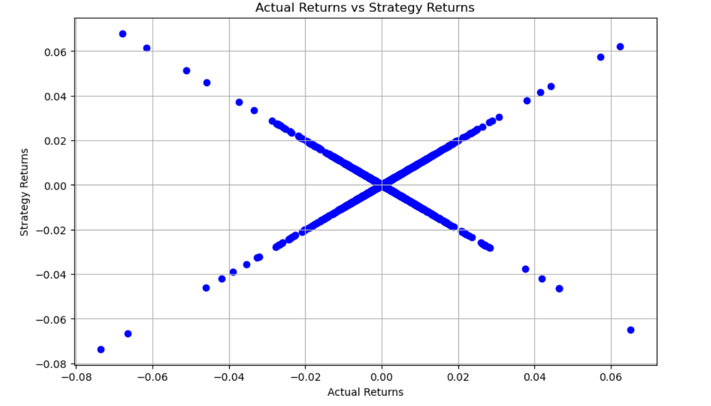
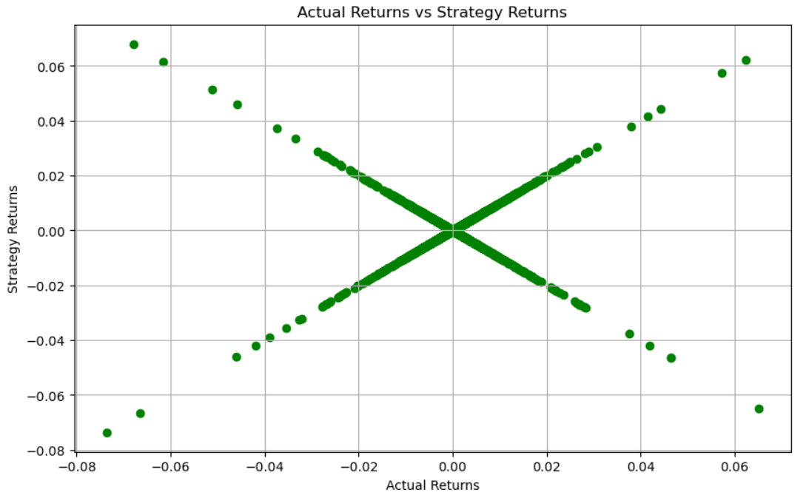

### Decepticons-machine-learning

---
*   In this project I assumed the role of a financial advisor at one of the top five financial advisory firms in the world. My firm constantly competes with the other major firms to manage and automatically trade assets in a highly lucrative & dynamic environment. In recent years, the firm has heavily profited by using computer algorithms that can buy and sell faster than human traders.
*   The speed of these transactions gave my firm a competitive advantage early on. But, people still need to specifically program these systems, which limits their ability to adapt to new data. Being a proactive person,I planned to improve the existing algorithmic trading systems and maintain the firm’s competitive advantage in the market. To do so, I enhanced the existing trading signals with machine learning algorithms that can adapt to new data.

---
## The Process
I combined the new algorithmic trading skills with I existing skills in financial Python programming and machine learning and created an algorithmic trading bot that learns and adapts to new data and evolving markets.
---

In Jupyter notebook, I executed the following:

* Implement an algorithmic trading strategy that uses machine learning to automate the trade decisions.

* Adjust the input parameters to optimize the trading algorithm.

* Train a new machine learning model and compare its performance to that of a baseline model.
---
### Results
## The cumulative product of the actual returns vs. the strategy returns (baseline model)

---
## The cumulative product of the actual returns vs. the strategy returns (new model)

* Upon creation and rigorous testing the new model I created performed worse than the baseline model. In the baseline model, the accuracy was 56% while in my new version's accuracy was 55%. The difference wasn't as significant as I was anticipating that it would be.
 

